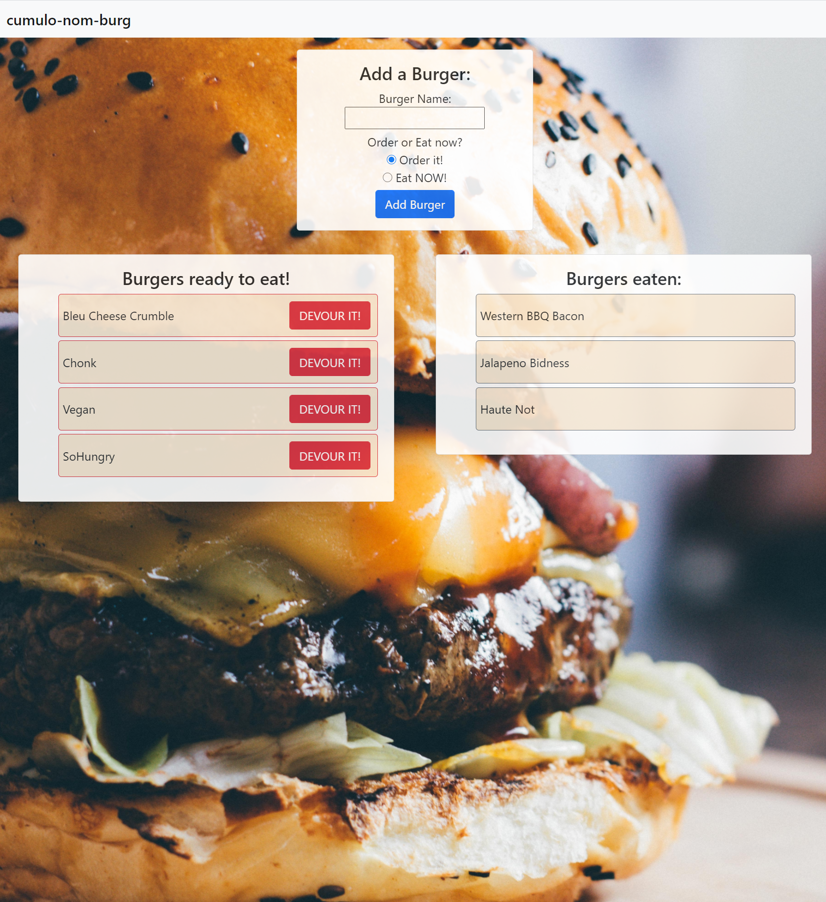

# cumulo-nom-burg

## Table of Contents
- [cumulo-nom-burg](#cumulo-nom-burg)
- [Description](#description)
- [Installation](#installation)
- [Usage](#usage)
- [Licence](#licence)
- [Thanks](#thanks)
- [Questions](#questions)

## Description

Create, persist & consume tasty burger objects in the cloud.




[GitHub Repo](https://www.github.com/brhestir/cumulo-nom-burg)

[Deployed Heroku Site](https://pure-tor-88060.herokuapp.com/)

## Installation
```bash
npm install
```

## Usage
```bash
npm start
```

## Licence
MIT

## Thanks
- Photo by [Artem Beliaikin](https://www.pexels.com/@belart84?utm_content=attributionCopyText&utm_medium=referral&utm_source=pexels) from [Pexels](https://www.pexels.com/photo/red-burgers-freestanding-letter-on-wall-617230/?utm_content=attributionCopyText&utm_medium=referral&utm_source=pexels)
- Photo by [Tioroshi Lazaro](https://www.pexels.com/@tioroshi?utm_content=attributionCopyText&utm_medium=referral&utm_source=pexels) from [Pexels](https://www.pexels.com/photo/hamburger-with-cheese-2874979/?utm_content=attributionCopyText&utm_medium=referral&utm_source=pexels)

## Questions
Questions are welcome, contact me on GitHub or in the comments.


